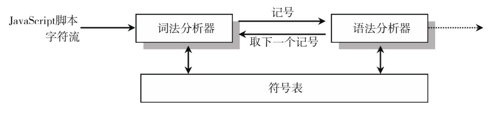

# AST入门与简单应用

- [简介](#简介)
- [词法分析与语法分析](#词法分析与语法分析)
    - [词法分析/分词(Tokenizing/Lexing)](#词法分析/分词(Tokenizing/Lexing))
    - [语法分析/解析(Parsing)](#语法分析/解析(Parsing))
    - [代码生成(Code Generation)](#代码生成(Code-Generation))
- [常用AST对象](#常用AST对象)
    - [Statement（语句）](#Statement（语句）)
    - [Declaration（声明）](#Declaration（声明）)
    - [Expression（表达式）](#Expression（表达式）)
- [常用 JS 解析器](#常用-JS-解析器)
- [工具库 recast](#工具库-recast)
    - [recast.parse](#recast.parse)
    - [recast.print](#recast.print)
    - [recast.prettyPrint](#recast.prettyPrint)
    - [recast.types.builders](#recast.types.builders)
    - [recast.run](#recast.run)
    - [recast.visit](#recast.visit)
    - [recast.types.namedTypes](#recast.types.namedTypes)
- [实现一个 webpack loader](#实现一个-webpack-loader)
- [Online工具](#Online工具)
- [See Also](#See-Also)

## 简介

> AST：全称 Abstract Syntax Tree，意为抽象语法树，它是源代码语法结构的树状表现形式。

应用场景：代码编译、压缩、混淆、优化，打包构建，lint工具。  
使用AST的工具或库：Babel，TypeScript，Webpack，Rollup，UglifyJS，ESlint。

## 词法分析与语法分析

### 词法分析/分词(Tokenizing/Lexing)

将字符流(char stream)转换为记号流(token stream)，由字符串组成的字符分解成有意义的代码块，这些代码块称为词法单元。  
例如：一段 JS 代码 var name = 'Hello World'; 会被分解为词法单元：var、name、=、Hello World、;。

```json
[
  {
    "type": "Keyword",
    "value": "var"
  },
  {
    "type": "Identifier",
    "value": "name"
  },
  {
    "type": "Punctuator",
    "value": "="
  },
  {
    "type": "String",
    "value": "'Hello World'"
  },
  {
    "type": "Punctuator",
    "value": ";"
  }
]
```
最小词法单元主要有空格、注释、字符串、数字、标识符、运算符、括号等。

### 语法分析/解析(Parsing)

将词法单元流转换成一个由元素逐级嵌套所组成的代表了程序语法结构的树（AST）。
词法分析和语法分析是交错进行的，词法分析器每取得一个词法记号，就将其送入语法分析器进行分析。



var name = 'Hello World'; 转成 AST 如下：

```json
{
  "type": "Program",
  "body": [
    {
      "type": "VariableDeclaration",
      "declarations": [
        {
          "type": "VariableDeclarator",
          "id": {
            "type": "Identifier",
            "name": "name"
          },
          "init": {
            "type": "Literal",
            "value": "Hello World",
            "raw": "'Hello World'"
          }
        }
      ],
      "kind": "var"
    }
  ],
  "sourceType": "script"
}
```

### 代码生成(Code Generation)

深度优先遍历整个 AST，然后构建可以表示转换后代码的字符串。

## 常用AST对象

### Statement（语句）

```js
BlockStatement
EmptyStatement
ExpressionStatement
IfStatement
LabeledStatement
BreakStatement
ContinueStatement
WithStatement
SwitchStatement
ReturnStatement
TryStatement
ThrowStatement
WhileStatement
DoWhileStatement
ForInStatement
ForOfStatement
LetStatement
DebuggerStatement
```

### Declaration（声明）

```js
FunctionDeclaration
VariableDeclaration
VariableDeclarator // 声明符
```

### Expression（表达式）

```js
ThisExpression
ArrayExpression
ObjectExpression
FunctionExpression
SequenceExpression
UnaryExpression
BinaryExpression
AssignmentExpression
LogicalExpression
ConditionalExpression
NewExpression
MemberExpression
YieldExpression
ComprehensionExpression
GraphExpression
```

## 常用 JS 解析器

AST 的规范 -- [EsTree](https://github.com/estree/estree)

- [uglify-js](https://github.com/mishoo/UglifyJS) 用于混淆和压缩代码；
- [Esprima](https://esprima.org/) 第一个用JS编写的符合EsTree规范的JS的解析器；
- [acorn](https://github.com/acornjs/acorn) 目前webpack的AST解析器；
- [@babel/parser(babylon)](https://github.com/babel/babel/tree/master/packages/babel-parser) babel官方的解析器，最初fork于acorn；
- [espree](https://github.com/eslint/espree) eslint、prettier的默认解析器，基于acorn；
- [swc](https://github.com/swc-project/swc) 用rust编写的js编译器，单核比babel快4倍，4核比babel快70倍；
- [esbuild](https://github.com/evanw/esbuild/) 用go编写的web打包工具，它拥有目前最快的打包记录和压缩记录，snowpack和vite的也是使用它来做打包工具；

## 工具库 recast

[recast](https://github.com/benjamn/recast) 可以同时使用多种解析器，并且可以自定义传入需要的解析器。

- [recast.parse](#recast.parse)
- [recast.print](#recast.print)
- [recast.prettyPrint](#recast.prettyPrint)
- [recast.types.builders](#recast.types.builders)
- [recast.run](#recast.run)
- [recast.visit](#recast.visit)
- [recast.types.namedTypes](#recast.types.namedTypes)

### recast.parse

```js
const recast = require('recast')

const code = `function add (a, b) {
  return a + b
}`

const ast = recast.parse(code)
// 获取代码块 ast 的第一个 body，即我们的 add 函数
const add = ast.program.body[0]
console.log(add)
```

### recast.print

```js
const recast = require('recast')

const code = `function add (a, b) {
  return a + b
}`

const ast = recast.parse(code)

console.log(recast.print(ast).code)
```

### recast.prettyPrint

```js
const recast = require('recast')

const code = `function add (a, b) { return a + b }`

const ast = recast.parse(code)

console.log(recast.prettyPrint(ast, { tabWidth: 2 }).code)
```

### recast.types.builders

示例：具名函数转换成箭头函数

```js
const recast = require('recast')
const {
  variableDeclaration,
  variableDeclarator,
  functionExpression
} = recast.types.builders

const code = `function add (a, b) {
  return a + b
}`

const ast = recast.parse(code)
const add = ast.program.body[0]

ast.program.body[0] = variableDeclaration('const', [
  variableDeclarator(add.id, functionExpression(
    null, // 这里弄成匿名函数即可
    add.params,
    add.body
  ))
])

const output = recast.print(ast).code

console.log(output)
```

### recast.run

读取文件命令行

```js
// read.js
recast.run((ast, printSource) => {
  printSource(ast)
})
```

```js
// demo.js
function add (a, b) {
  return a + b
}
```

$ node read demo.js

### recast.visit

遍历 AST 节点

- 每个 visit，必须加上 return false，或者 this.traverse(path)，否则报错；
- 在需要遍历的类型前面加上 visit 即可遍历；

```js
const recast = require('recast')

recast.run((ast, printSource) => {
  recast.visit(ast, {
    visitArrowFunctionExpression (path) {
      printSource(path.node)
      return false
    }
  })
})
```

### recast.types.namedTypes

判断 AST 对象是否为指定类型

```js
const recast = require('recast')
const t = recast.types.namedTypes

const arrowNoop = () => {}

const ast = recast.parse(arrowNoop)

recast.visit(ast, {
  visitArrowFunctionExpression ({ node }) {
    console.log(t.ArrowFunctionExpression.check(node))
    return false
  }
})
```

## 实现一个 webpack loader

转换前：
```js
this.axiosFetch(this.formData).then(res => {
  this.loading = false
  this.handleClose()
})
```

转换后：
```js
this.axiosFetch(this.formData).then(res => {
  this.loading = false
  this.handleClose()
}).catch(() => {
  this.loading = false
})
```

实现代码：
```js
const recast = require('recast')
const {
  identifier: id,
  memberExpression,
  callExpression,
  blockStatement,
  arrowFunctionExpression
} = recast.types.builders
const t = recast.types.namedTypes

const code = `this.axiosFetch(this.formData).then(res => {
  this.loading = false
  this.handleClose()
})`
const ast = recast.parse(code)
let firstExp

recast.visit(ast, {
  visitArrowFunctionExpression ({ node, parentPath }) {
    const parentNode = parentPath.node
    if (
      t.CallExpression.check(parentNode) &&
      t.Identifier.check(parentNode.callee.property) &&
      parentNode.callee.property.name === 'then'
    ) {
      firstExp = node.body.body[0]
    }
    return false
  }
})

recast.visit(ast, {
  visitCallExpression (path) {
    const { node } = path

    const arrowFunc = arrowFunctionExpression([], blockStatement([firstExp]))
    const originFunc = callExpression(node.callee, node.arguments)
    const catchFunc = callExpression(id('catch'), [arrowFunc])
    const newFunc = memberExpression(originFunc, catchFunc)

    path.replace(newFunc)

    return false
  }
})

const output = recast.print(ast).code
console.log(output)
```

## Online工具

- [AST explorer](https://astexplorer.net/)

## See Also

- [AST 对象文档](https://developer.mozilla.org/zh-CN/docs/Mozilla/Projects/SpiderMonkey/Parser_API)
- [@babel/types](https://babeljs.io/docs/en/babel-types)
- [简单介绍下各种js解析器](https://www.yuque.com/yuexing0921/blog/etiot2)
- [JS AST 原理揭秘](https://zhaomenghuan.js.org/blog/js-ast-principle-reveals.html)
- [AST 与前端工程化实战](https://zhuanlan.zhihu.com/p/77696194)
- [你不知道的AST](https://aszero.com/2020/06/03/%E4%BD%A0%E4%B8%8D%E7%9F%A5%E9%81%93%E7%9A%84AST/)
